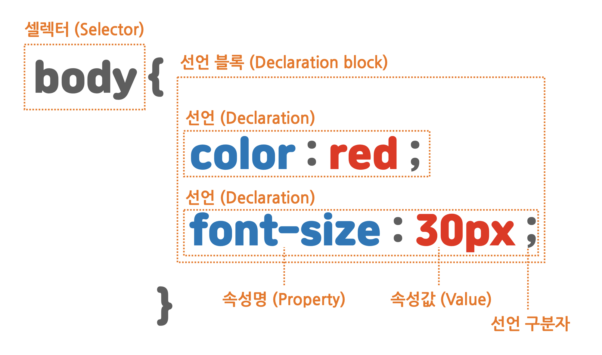

# CSS 가 무엇인가

Cascading Style Sheets의 약자

더 나은 `UX(User eXperience)`를 위해 사용

> CSS 이해를 돕기위한 사진
>    src="Images/explainCSS.png"
>   alt="explainCSS"
> />

# CSS 문법 구성



# CSS 추가 방법

<ol>
    <li>인라인 스타일</li>
    <ul>
        <li>같은 줄에 스타일을 적용</li>
    </ul>
    <li>내부 스타일 시트</li>
    <ul>
        <li>별도의 파일로 구분하지 않고 style 요소 내에 작성해 적용</li>
    </ul>
    <li>외부 스타일 시트</li>
    <ul>
        <li>link 요소에 css 파일의 경로를 적어 연동</li>
    </ul>
</ol>

## 외부 스타일 시트 사용 방법
```html
<link rel="stylesheet" href="index.css" />
```